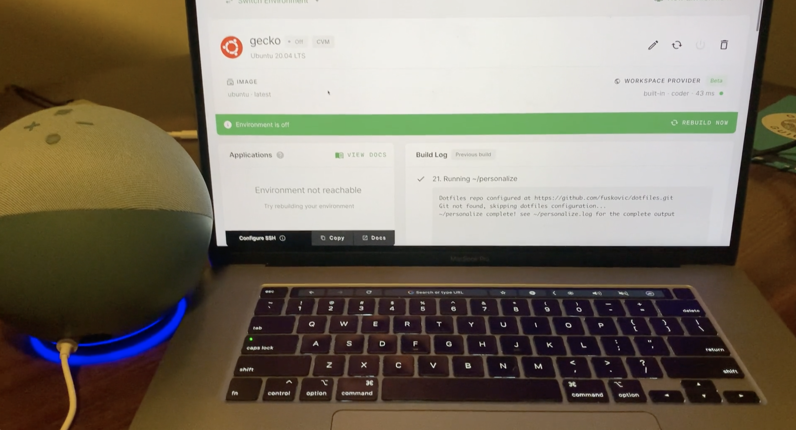

# Gecko

Submission for the 2021 Coder Hackathon.

Gecko is a Coder Enterprise Alexa skill for the Amazon Echo written in Go.

You can use it to rebuild your cloud environment by telling Alexa:

    Alexa, ask coder enterprise to rebuild my-cloud-environment

Where `my-cloud-environment` is the name of an existing coder enterprise environment you own.

## Demo

# Interested in setting up gecko for your Coder environment?

Visit the [setup docs](https://github.com/fuskovic/gecko/blob/master/docs/setup.md) for detailed instructions on configuring the Alexa Skill and AWS Lambda function.