## Pre-requisites

- [Coder Enterprise Account](https://coder.com/trial)
- [Amazon Alexa Developer Profile](https://developer.amazon.com/en-US/alexa)
- AWS Account
- Amazon Account
- Amazon Alexa Mobile app

## Step 1 - Download the latest Gecko release

Check the [releases page](https://github.com/fuskovic/gecko/releases) for the latest version.

## Step 2 - Create a new AWS Lambda function in the AWS Dashboard

- Select `Author from scratch`
- Assign a function name
- Select the `Go 1.x` runtime
- Click `Create function`

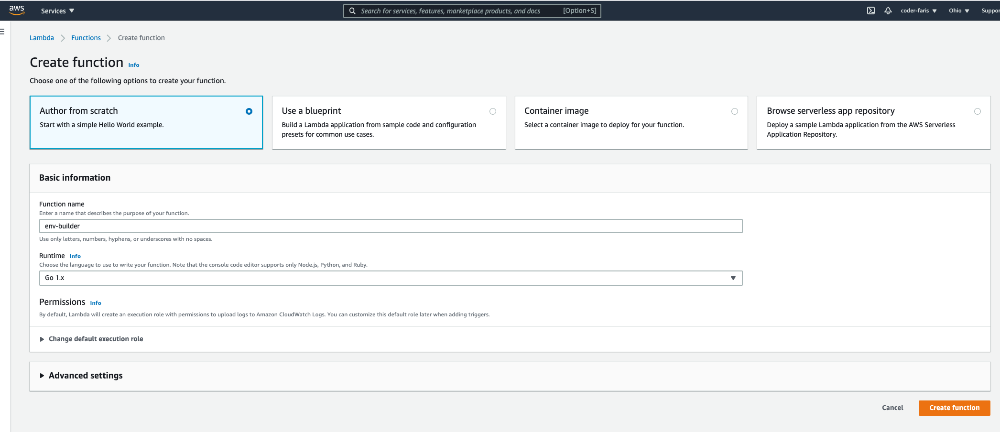

## Step 3 - Edit your code source settings

- Scroll down to `Code source` section
- Click `Upload from:`
- Select `.zip file` from the drop-down menu

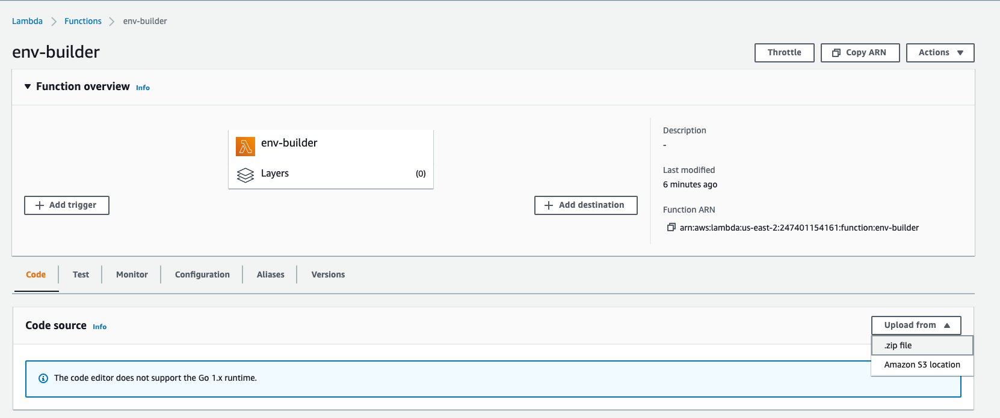

- Upload the zipped Gecko release that you downloaded in step 1

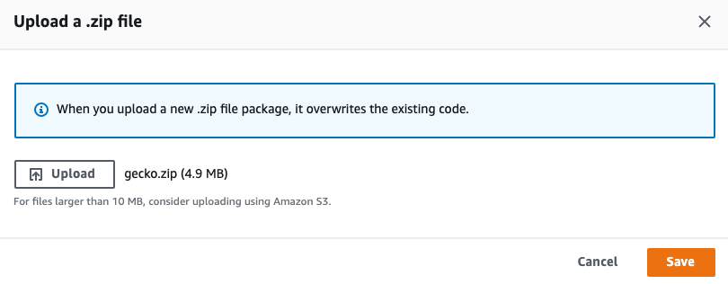

## Step 4 - Edit your runtime settings

Underneath the `Code source settings` you'll find the runtime settings.

- Click `Edit` on the right-hand side of the `Runtime settings`
- Change the handler to `gecko` and save

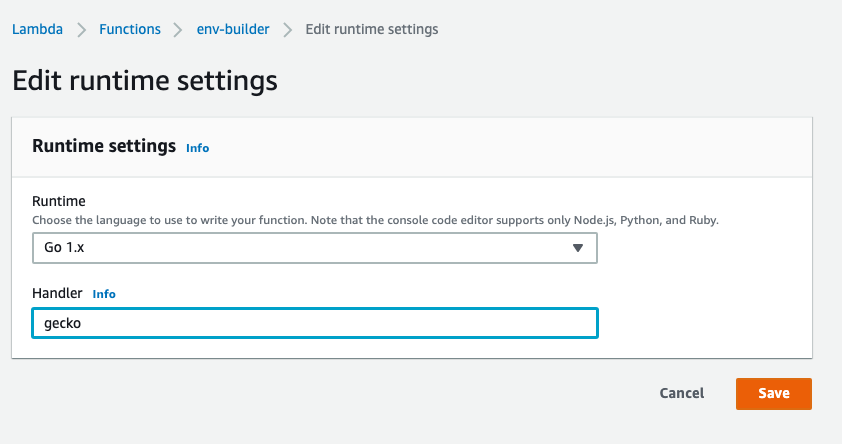

## Step 5 - Configure environment variables

- Click on `Configuration` in the horizontal tab menu
- Click on `Environment variables` on the vertical tab menu on the left-hand side

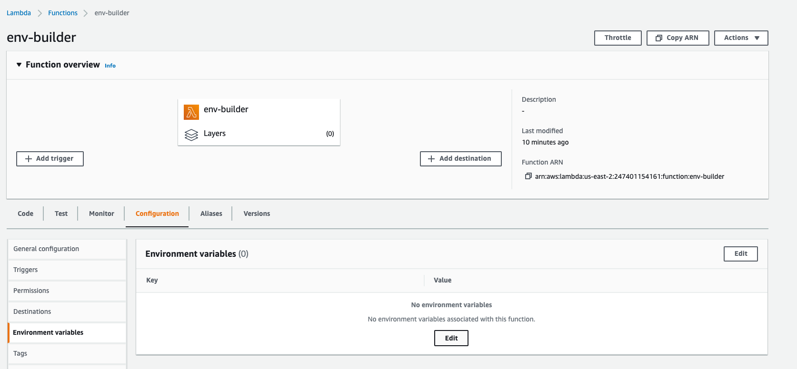

- Click `Edit` and you'll be taken to the following page

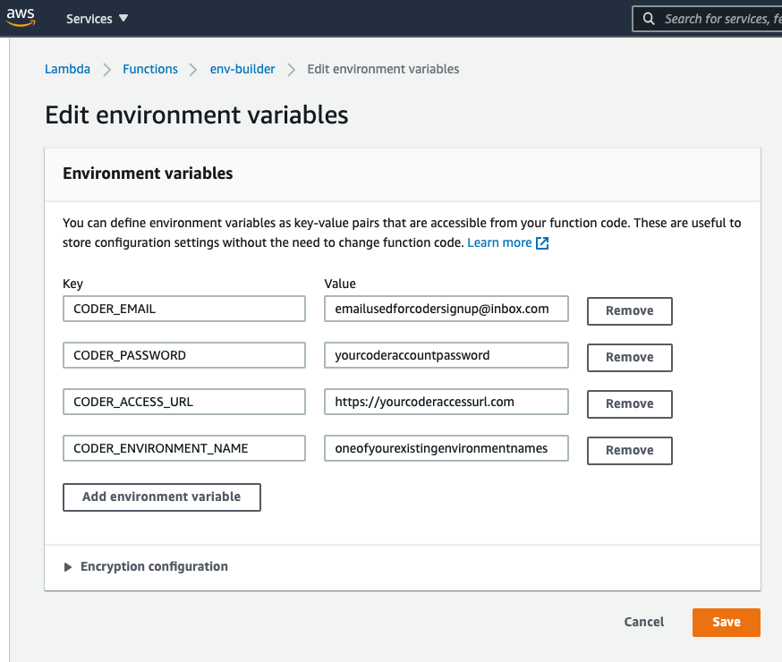

**Note**: If you don't know your coder access url, navigate to your Coder enterprise admin settings and it's the first thing you see on the `Infrastructure` page:

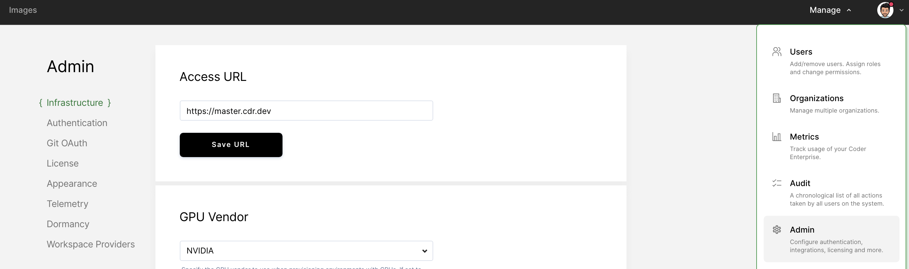

There is more configuration to do but we won't be able to do so until our Alexa skill is configured so lets switch gears and head to our Amazon Alexa Developer Console.

## Step 6 - Create a new Amazon Alexa skill in the Alexa Developer Console

- Click `Create Skill`

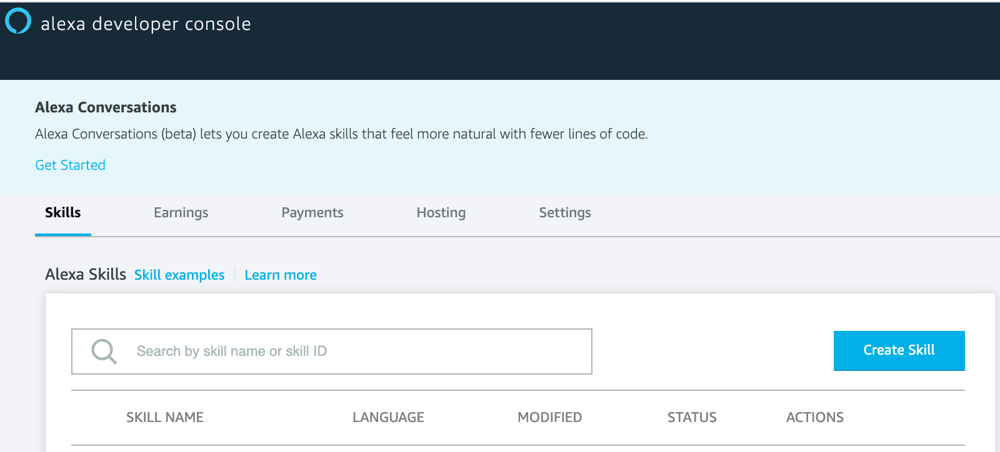

- Name your skill(this is how it will be identified in your mobile Alexa app)
- Choose a custom model
- Select `Provision your own` since our Lambda function is hosted on AWS.

`NOTE There is a discrepancy here.`

**It's important to set the language to English(US) and NOT English(UK) like you see in the screenshot below.
This tripped me up. This will actually prevent you Amazon Echo from executing the skill properly since
the Amazon Alexa Mobile App you download will use English(US) by default. In other words, they need to
match for it to work.**

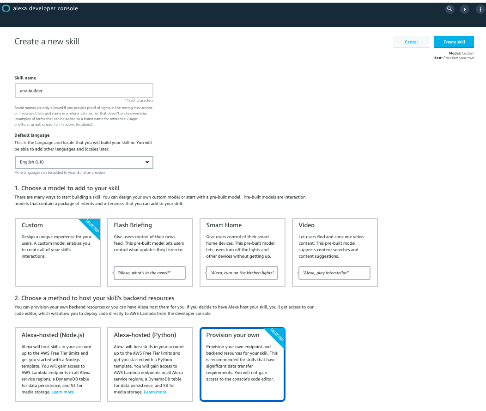

 - On the next page, select `Start from scratch`

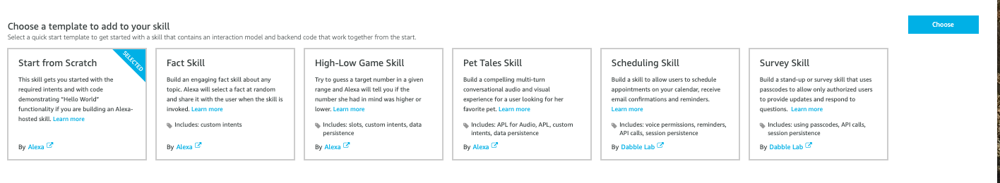

## Step 7 - Set a new Skill Invocation Name

- Click `Invocation` in the upper left-hand corner

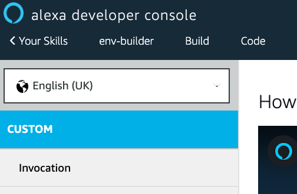

- Change the name to `coder enterprise` in the `Skill Invocation Name` field

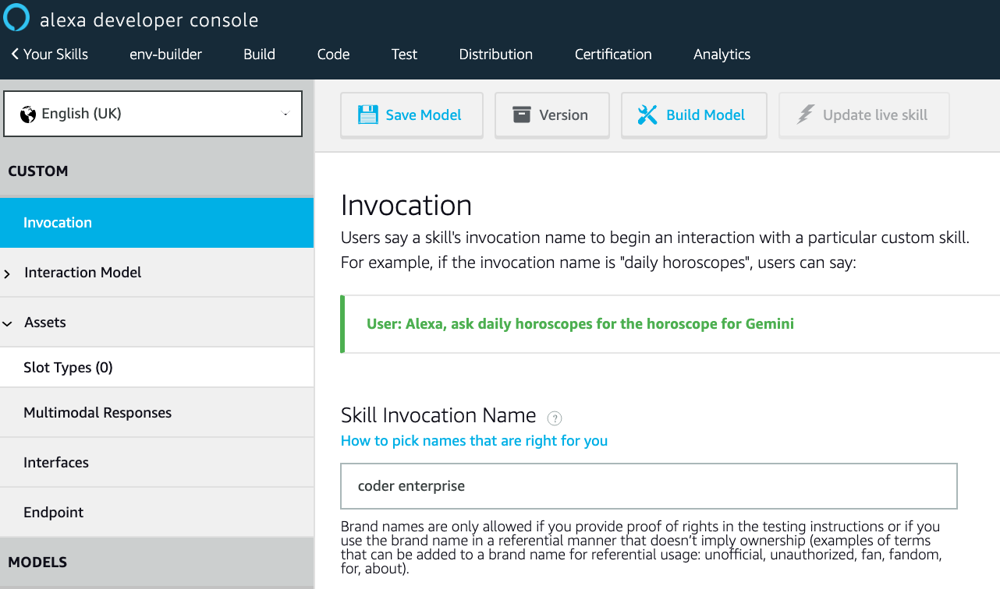

- Click `Save Model` before moving on to the next step.

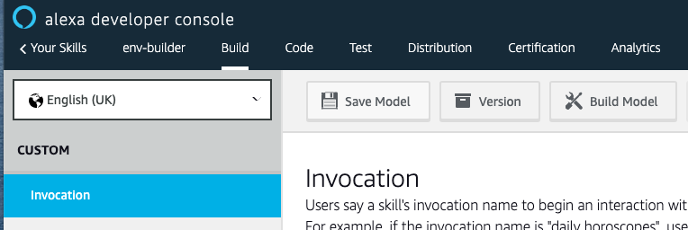

## Step 8 - Add an Intent

- Click `Interaction Model` in the upper left-hand corner
- In the drop-down menu, click `Intents`

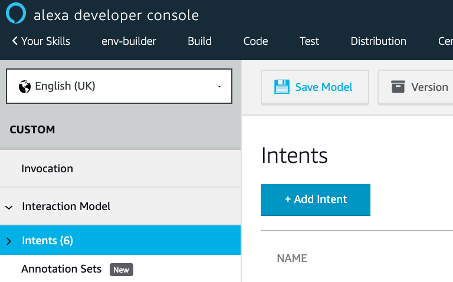

- Create a custom intent called `rebuild`

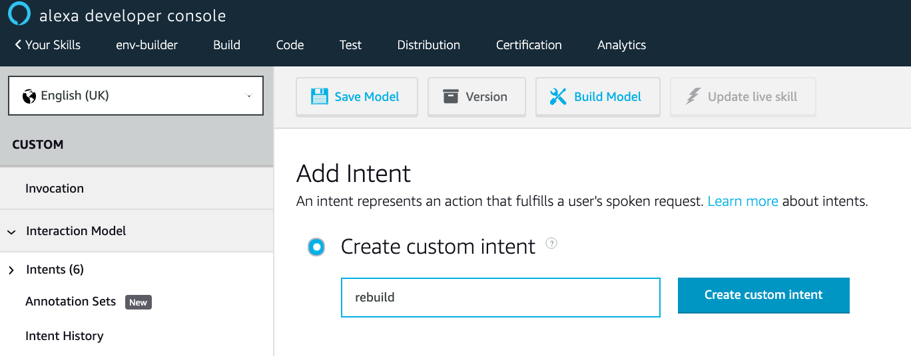

- Add an utterance called `rebuild [my-environment]` where `my-environment` is equal to the value you set for `CODER_ENVIRONMENT_NAME` in the AWS Lambda function. I have a Coder environment called `gecko` so I'll use that.

- Don't forget to click the `+` sign on the right-hand side to finalize adding your utterance.

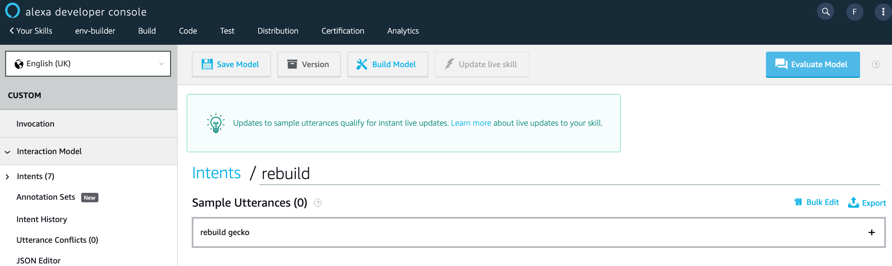

## Step 9 - Link the Alexa skill as a trigger for the Lambda function

- In your Alexa developer console, click `Endpoint` on the bottom left-hand corner.
- Click `Copy to Clipboard` near `Your Skill ID`

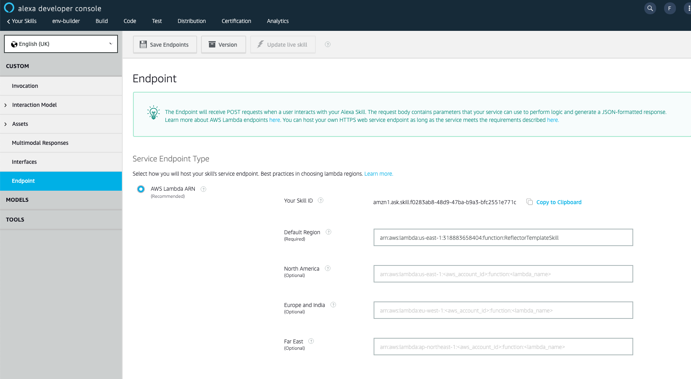

- Keep this page open but go back to your AWS Lambda dashboard
- In your AWS Lambda dashboard, click `Add Trigger`

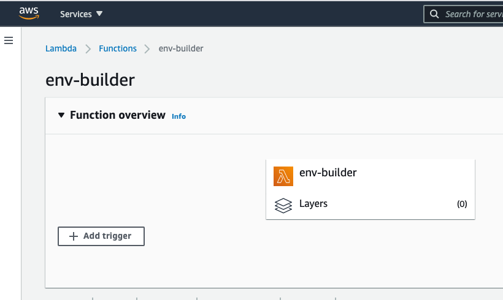

- Select `Alexa Skills Kit` from the `Trigger configuration` drop-down.

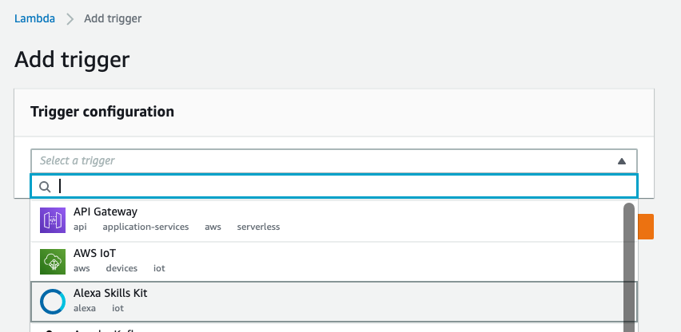

- Make sure `Skill ID Verification` is enabled
- Paste your `Skill ID` in the `Skill ID` input field.
- Click `Add`

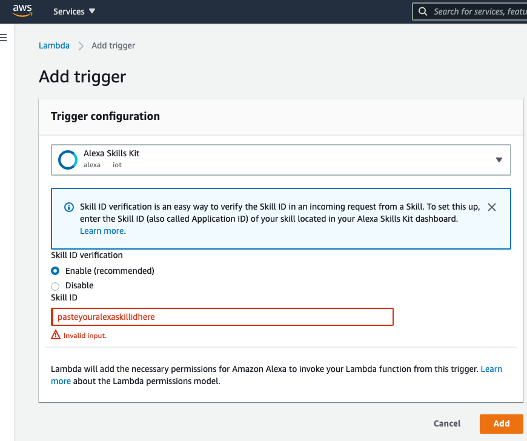

## Step 10 - Configure the Alexa skill to POST to your Lambda backend

- In your AWS Lambda dashboard, click `Copy ARN` in the upper right-hand corner.

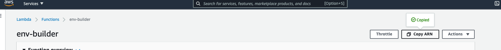

- In your Alexa developer console, paste your ARN in the default region input; overwriting the existing value.

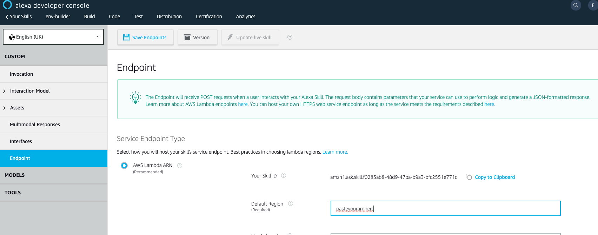

- Click `Save Endpoints`

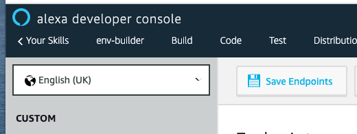

- Click `Save Model`
- Click `Build Model`

- If all goes well, you should see a success message

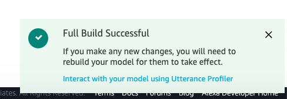

## Last step - Enable your new skill on your Alexa mobile app

- Navigate to `More` -> `Skills & Games` -> `Dev`
- Click `Enable to Use`

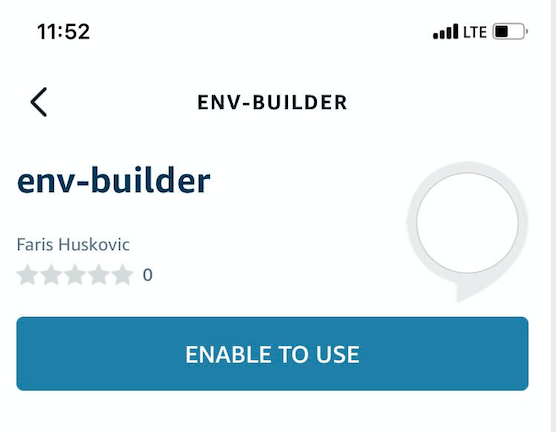

Now you can tell Alexa:

`Alexa, ask coder enterprise to rebuild [env_name]`

Where `env_name` is equal to whatever coder environment name you used in your utterance in step 8.

For me, I would say:

`Alexa, ask coder enterprise to rebuild gecko`

Because I have an existing coder environment named gecko.

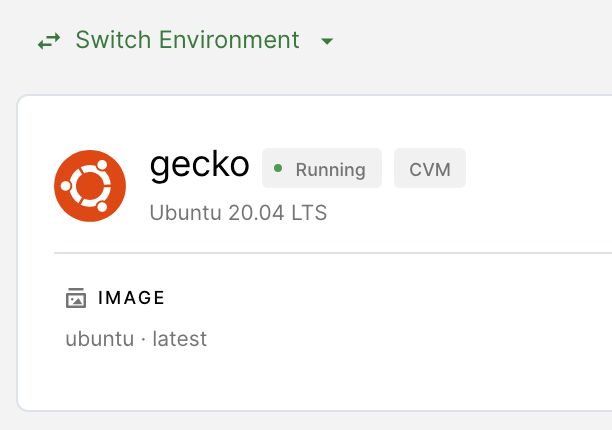